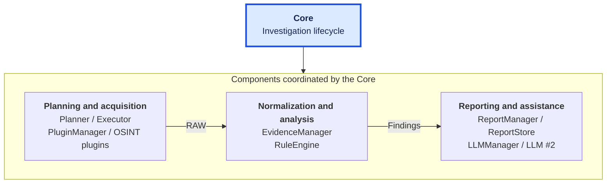

# CENTAURUS OSINT Framework

[Español](README.md) | [English](README.en.md)

CENTAURUS is a modular, local-first OSINT framework designed for Blue Team, security analysis and IT environments.

It provides a reproducible workflow for collecting public information, normalizing evidence, applying deterministic analysis rules and generating traceable investigation reports, while keeping operational decisions outside the language model.

## Design foundations

CENTAURUS is designed so an analyst can answer **“Why does the system make this claim, and which observations support it?”** Three foundations guide the application:

- **Deterministic results:** explicit rules produce findings from normalized evidence. The persisted report is authoritative; LLM assistance does not create or alter its conclusions. [Evaluation and limits](docs/RULES_AND_RULE_ENGINE.en.md).
- **Forward and reverse traceability:** follow how observations become findings, or start with a report and inspect the rules and evidence supporting it, then correlate them with the preserved RAW. [Audit trail](docs/STORAGE.en.md#9-traceability).
- **Modularity through contracts:** acquisition, normalization, rules, reporting and persistence have separate responsibilities. Components can evolve while preserving those contracts and the Core’s coordination. [Extension boundaries](docs/ARCHITECTURE.en.md#13-architectural-evolution).

These foundations make the analysis explainable and reviewable. Repeating live queries can yield different observations; determinism applies to evaluating the same inputs with the same rules and implementation.

## Key features

- Modular plugin architecture.
- Passive OSINT collection.
- Deterministic `Evidence -> Findings -> Report` pipeline.
- Local LLM integration through Ollama.
- Separation between authoritative deterministic reporting and non-authoritative LLM assistance.
- Persistent workspace for investigations, evidence, findings, reports and logs.
- VMware appliance distribution.
- Bootable USB image distribution.
- Git + Docker deployment on Linux.
- Local-first execution model.
- Apache License 2.0.

## Included OSINT capabilities

The current framework integrates six OSINT tools/capabilities:

- WHOIS lookup
- RDAP lookup
- DNSRecon
- Sublist3r
- TheHarvester
- crt.sh lookup

The architecture is designed so additional tools can be incorporated through the plugin model without redesigning the Core.

## Architecture at a glance

The CLI sends the input to `RequestInterpreter`, which passes a `StructuredRequest` to the **Core**. The Core governs the investigation and coordinates the following components:



`RequestInterpreter` first constructs the Target deterministically and then asks LLM #1 to classify the Intent from the same input. Both are combined in `StructuredRequest`; the LLM does not construct the Target. The upper block identifies the Core as the governing component. Inside the coordinated-components area, arrows show the main data flow. The Core governs planning, execution, knowledge processing and persistence. In the final group, `ReportManager` builds the report, the Core persists it through `ReportStore`, and `LLMManager` coordinates subsequent assistance. LLM #2 runs after persistence and its output is grounded, ephemeral and fail-soft.

See [`ARCHITECTURE.en.md`](docs/ARCHITECTURE.en.md) for component responsibilities.

The language model does not execute OSINT tools autonomously and does not generate authoritative findings. Operational execution and technical conclusions remain traceable through deterministic components.

## Quick start — VMware OVA

The prebuilt OVA is the main CENTAURUS distribution. Follow [`DEPLOYMENT_OVA.en.md`](docs/DEPLOYMENT_OVA.en.md) to download and verify it, import it into VMware and open your first session.

For USB, Git + Docker on Linux or local Core on Windows, see [`INSTALL.en.md`](docs/INSTALL.en.md).

## Distribution modes

CENTAURUS is designed around several distribution modes.

### VMware appliance

The OVA is the main distribution. Download, published size and SHA-256, resource requirements, import and initial credentials: [`DEPLOYMENT_OVA.en.md`](docs/DEPLOYMENT_OVA.en.md).

### Bootable USB image

The raw image boots the appliance on compatible hardware and requires wired Ethernet. Download, published size and SHA-256, writing and first boot: [`DEPLOYMENT_USB.en.md`](docs/DEPLOYMENT_USB.en.md).

OVA/USB binaries are hosted externally. Verify their identity against the corresponding deployment guide before use.

### Git + Docker

Recommended when the framework is deployed from source on a compatible Linux host.

The repository contains the Core, Docker/Compose definitions, dependency locks, initialization scripts and deployment documentation.

Procedure: [`DEPLOYMENT_GIT_DOCKER.en.md`](docs/DEPLOYMENT_GIT_DOCKER.en.md).

## Windows

Native Windows can be used for development, Core execution and local Ollama workflows.

Windows is not presented as equivalent to the complete Linux + Docker distribution for all integrated OSINT tools or for the hardened container runtime. See [`DEPLOYMENT_WINDOWS.en.md`](docs/DEPLOYMENT_WINDOWS.en.md) and [`PROJECT.en.md`](docs/PROJECT.en.md) for the documented scope.

## Local LLM

CENTAURUS uses Ollama for local language-model capabilities.

The current design separates two logical LLM roles:

- **LLM #1 - interpretation:** converts a natural-language request into a validated Intent.
- **LLM #2 - analyst assistance:** operates after the deterministic Report exists and is non-authoritative and fail-soft.

The deterministic report remains valid even if analyst assistance is unavailable or times out.

## Persistence

Runtime data is kept outside the application image in a persistent workspace.

Each investigation’s artifacts are stored in the persistent workspace, organized by investigation ID:

```text
workspace/
└── investigations/
    └── <investigation-id>/
        ├── evidences/
        │   ├── raw/
        │   └── normalized/
        ├── findings/
        ├── reports/
        │   ├── report.json
        │   └── report.md
        └── execution/
            └── failures/
```

See [`STORAGE.en.md`](docs/STORAGE.en.md) for the authoritative storage model.

## Tests

The repository includes the automated test suite under:

```text
tests/
```

In a prepared development/test environment:

```bash
python -m pytest
```

See [`DEVELOPMENT.en.md`](docs/DEVELOPMENT.en.md) for development and validation guidance.

## Documentation

Choose the documents for your task; you do not need to read the full index in order.

### Start and use

- [`PROJECT.en.md`](docs/PROJECT.en.md) · [Español](docs/PROJECT.md) - project identity, scope and distribution modes.
- [`INSTALL.en.md`](docs/INSTALL.en.md) · [Español](docs/INSTALL.md) - deployment and installation.
- [`USER_GUIDE.en.md`](docs/USER_GUIDE.en.md) · [Español](docs/USER_GUIDE.md) - first session, result interpretation and troubleshooting.
- [`TROUBLESHOOTING.en.md`](docs/TROUBLESHOOTING.en.md) · [Español](docs/TROUBLESHOOTING.md) - issue diagnosis across deployment modes.

### Deploy and administer

- [`DEPLOYMENT_OVA.en.md`](docs/DEPLOYMENT_OVA.en.md) · [Español](docs/DEPLOYMENT_OVA.md) - OVA import, operation and maintenance.
- [`DEPLOYMENT_USB.en.md`](docs/DEPLOYMENT_USB.en.md) · [Español](docs/DEPLOYMENT_USB.md) - raw image writing, boot and persistence.
- [`DEPLOYMENT_GIT_DOCKER.en.md`](docs/DEPLOYMENT_GIT_DOCKER.en.md) · [Español](docs/DEPLOYMENT_GIT_DOCKER.md) - deployment from source on Linux.
- [`DEPLOYMENT_WINDOWS.en.md`](docs/DEPLOYMENT_WINDOWS.en.md) · [Español](docs/DEPLOYMENT_WINDOWS.md) - local Core setup on Windows.
- [`GPU_OLLAMA_DOCKER.en.md`](docs/GPU_OLLAMA_DOCKER.en.md) · [Español](docs/GPU_OLLAMA_DOCKER.md) - optional experimental acceleration, without project GPU certification.
- [`CONFIGURATION.en.md`](docs/CONFIGURATION.en.md) · [Español](docs/CONFIGURATION.md) - runtime variables, defaults and deployment differences.

### Understand the architecture

- [`ARCHITECTURE.en.md`](docs/ARCHITECTURE.en.md) · [Español](docs/ARCHITECTURE.md) - framework architecture.
- [`SPECIFICATION.en.md`](docs/SPECIFICATION.en.md) · [Español](docs/SPECIFICATION.md) - functional and non-functional specification.
- [`STORAGE.en.md`](docs/STORAGE.en.md) · [Español](docs/STORAGE.md) - persistence and traceability.
- [`RULES_AND_RULE_ENGINE.en.md`](docs/RULES_AND_RULE_ENGINE.en.md) · [Español](docs/RULES_AND_RULE_ENGINE.md) - rule catalog and finding interpretation.
- [`SECURITY_ARCHITECTURE.en.md`](docs/SECURITY_ARCHITECTURE.en.md) · [Español](docs/SECURITY_ARCHITECTURE.md) - trust boundaries, hardening and failure handling.
- [`CORE_RUNTIME.en.md`](docs/CORE_RUNTIME.en.md) · [Español](docs/CORE_RUNTIME.md) - investigation lifecycle, coordination and partial results.
- [`LLM_ARCHITECTURE.en.md`](docs/LLM_ARCHITECTURE.en.md) · [Español](docs/LLM_ARCHITECTURE.md) - roles, data projection, validation and assistance limits.

### Develop

- [`STANDARDS.en.md`](docs/STANDARDS.en.md) · [Español](docs/STANDARDS.md) - conventions and project standards.
- [`DEVELOPMENT.en.md`](docs/DEVELOPMENT.en.md) · [Español](docs/DEVELOPMENT.md) - development workflow.
- [`PLUGIN_SYSTEM.en.md`](docs/PLUGIN_SYSTEM.en.md) · [Español](docs/PLUGIN_SYSTEM.md) - contract, capability integration and source normalization.
- [`TESTING.en.md`](docs/TESTING.en.md) · [Español](docs/TESTING.md) - test levels, evidence and validation limits.

## Release

The deployment guides on `main` document the `v1.0.0` release and the OVA/USB artifacts identified in their respective guides. The `v1.0.0` tag retains an earlier documentation tree: switching to that tag does not bring the later guides into a local checkout. Use the [documentation on main](https://github.com/M4Rc0s-S3c/centaurus-osint-framework/tree/main/docs) alongside the selected release, and record the documentation commit for an audit. GPU examples remain experimental.

The release label `v1.0.0` is distinct from the Python package version: `pyproject.toml` declares `0.4.0-dev`, which packaging normalizes to `0.4.0.dev0`. Therefore, `centaurus --version` may display the package version rather than the release label. Identify a source deployment by its tag and full commit, and an appliance by its artifact hash; `--version` alone does not establish distribution identity.

Current public release:

**[v1.0.0](https://github.com/M4Rc0s-S3c/centaurus-osint-framework/releases/tag/v1.0.0)**

The academic TFM delivery was frozen separately and remains reproducible from the source-delivery commit documented in the submitted materials. Subsequent repository changes limited to public documentation and licensing do not alter that frozen academic snapshot.

## Responsible use

CENTAURUS is intended for legitimate OSINT, Blue Team, defensive-security, research and authorized assessment workflows.

Users are responsible for ensuring that their use of public sources, third-party tools and collected information complies with applicable law, source terms and organizational policy.

## License

CENTAURUS is licensed under the **Apache License, Version 2.0**.

See [`LICENSE`](LICENSE) for the full license text and [`NOTICE.md`](NOTICE.md) for attribution information.
