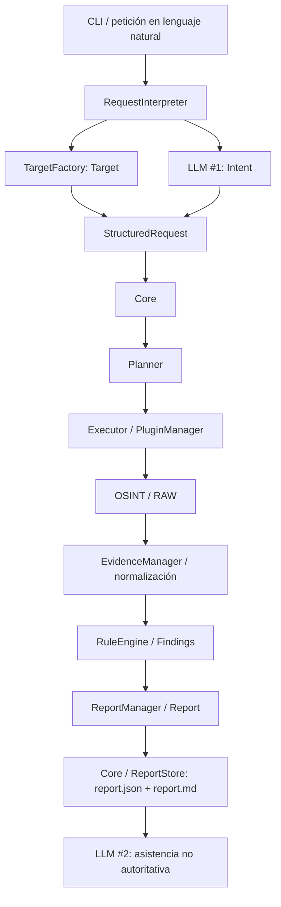

# CENTAURUS OSINT Framework

[Español](README.md) | [English](README.en.md)

CENTAURUS es un framework OSINT modular y orientado a ejecución local, diseñado para equipos Blue Team, análisis de seguridad y entornos IT.

Proporciona un flujo reproducible para recopilar información pública, normalizar evidencias, aplicar reglas de análisis deterministas y generar informes de investigación trazables, manteniendo las decisiones operativas fuera del modelo de lenguaje.

## Características principales

- Arquitectura modular basada en plugins.
- Recopilación OSINT pasiva.
- Flujo determinista `Evidence -> Findings -> Report`.
- Integración con LLM local mediante Ollama.
- Separación entre el informe autoritativo determinista y la asistencia no autoritativa del LLM.
- Workspace persistente para investigaciones, evidencias, hallazgos, informes y logs.
- Distribución como appliance VMware.
- Distribución mediante imagen USB arrancable.
- Despliegue Git + Docker sobre Linux.
- Modelo de ejecución local-first.
- Licencia Apache 2.0.

## Capacidades OSINT incluidas

La versión actual integra seis herramientas/capacidades OSINT:

- WHOIS lookup
- RDAP lookup
- DNSRecon
- Sublist3r
- TheHarvester
- crt.sh lookup

La arquitectura permite incorporar nuevas herramientas mediante el modelo de plugins sin rediseñar el Core.

## Arquitectura resumida



`RequestInterpreter` construye primero el Target de forma determinista y después solicita a LLM #1 la clasificación del Intent a partir de la misma entrada. Ambos se integran en `StructuredRequest`; el LLM no construye el Target. El Core orquesta el flujo posterior. LLM #2 actúa después de la persistencia y su salida es grounded, efímera y fail-soft.

Consulta [`ARCHITECTURE.md`](docs/ARCHITECTURE.md) para las responsabilidades de cada componente.

El modelo de lenguaje no ejecuta herramientas OSINT de forma autónoma ni genera hallazgos autoritativos. La ejecución operativa y las conclusiones técnicas permanecen trazables mediante componentes deterministas.

## Inicio rápido — OVA VMware

La OVA preconstruida es la distribución principal de CENTAURUS. Sigue [`DEPLOYMENT_OVA.md`](docs/DEPLOYMENT_OVA.md) para descargarla y verificarla, importarla en VMware y abrir tu primera sesión.

Para USB, Git + Docker sobre Linux o Core local en Windows, consulta [`INSTALL.md`](docs/INSTALL.md).

## Modalidades de distribución

CENTAURUS contempla varias modalidades de distribución.

### Appliance VMware

La OVA es la distribución principal. Descarga, tamaño y SHA-256 publicados, requisitos de recursos, importación y credenciales iniciales: [`DEPLOYMENT_OVA.md`](docs/DEPLOYMENT_OVA.md).

### Imagen USB arrancable

La imagen raw arranca la appliance sobre hardware compatible y requiere Ethernet cableada. Descarga, tamaño y SHA-256 publicados, escritura y primer arranque: [`DEPLOYMENT_USB.md`](docs/DEPLOYMENT_USB.md).

Los binarios OVA/USB se alojan externamente. Verifica su identidad en la guía de despliegue correspondiente antes de utilizarlos.

### Git + Docker

Recomendada cuando el framework se despliega desde código fuente sobre un host Linux compatible.

El repositorio incluye el Core, las definiciones Docker/Compose, locks de dependencias, scripts de inicialización y documentación de despliegue.

Procedimiento: [`DEPLOYMENT_GIT_DOCKER.md`](docs/DEPLOYMENT_GIT_DOCKER.md).

## Windows

Windows nativo puede utilizarse para desarrollo, ejecución del Core y flujos locales con Ollama.

No se presenta Windows como equivalente a la distribución completa Linux + Docker para todas las herramientas OSINT integradas ni para el runtime endurecido de contenedores. Consulta [`DEPLOYMENT_WINDOWS.md`](docs/DEPLOYMENT_WINDOWS.md) y [`PROJECT.md`](docs/PROJECT.md) para conocer el alcance documentado.

## LLM local

CENTAURUS utiliza Ollama para las capacidades locales de lenguaje.

El diseño actual separa dos roles lógicos de LLM:

- **LLM #1 - interpretación:** convierte una petición en lenguaje natural en un Intent validado.
- **LLM #2 - asistencia al analista:** actúa después de que exista el Report determinista y es no autoritativo y fail-soft.

El informe determinista continúa siendo válido aunque la asistencia al analista no esté disponible o agote su timeout.

## Persistencia

Los datos de runtime se mantienen fuera de la imagen de aplicación, en un workspace persistente.

Los artefactos de cada investigación se conservan en el workspace persistente, organizados por su identificador:

```text
workspace/
└── investigations/
    └── <investigation-id>/
        ├── evidences/
        │   ├── raw/
        │   └── normalized/
        ├── findings/
        ├── reports/
        │   ├── report.json
        │   └── report.md
        └── execution/
            └── failures/
```

Consulta [`STORAGE.md`](docs/STORAGE.md) para el modelo autoritativo de persistencia.

## Pruebas

El repositorio incluye la suite automatizada bajo:

```text
tests/
```

En un entorno de desarrollo/pruebas preparado:

```bash
python -m pytest
```

Consulta [`DEVELOPMENT.md`](docs/DEVELOPMENT.md) para las pautas de desarrollo y validación.

## Documentación

Elige los documentos según tu tarea; no es necesario leer todo el índice en orden.

### Empezar y usar

- [`PROJECT.md`](docs/PROJECT.md) · [English](docs/PROJECT.en.md) - identidad del proyecto, alcance y modalidades de distribución.
- [`INSTALL.md`](docs/INSTALL.md) · [English](docs/INSTALL.en.md) - despliegue e instalación.
- [`USER_GUIDE.md`](docs/USER_GUIDE.md) · [English](docs/USER_GUIDE.en.md) - primera sesión, interpretación de resultados y resolución de incidencias.
- [`TROUBLESHOOTING.md`](docs/TROUBLESHOOTING.md) · [English](docs/TROUBLESHOOTING.en.md) - diagnóstico de incidencias en las distintas modalidades.

### Desplegar y administrar

- [`DEPLOYMENT_OVA.md`](docs/DEPLOYMENT_OVA.md) · [English](docs/DEPLOYMENT_OVA.en.md) - importación, uso y mantenimiento de la OVA.
- [`DEPLOYMENT_USB.md`](docs/DEPLOYMENT_USB.md) · [English](docs/DEPLOYMENT_USB.en.md) - escritura de la imagen raw, arranque y persistencia.
- [`DEPLOYMENT_GIT_DOCKER.md`](docs/DEPLOYMENT_GIT_DOCKER.md) · [English](docs/DEPLOYMENT_GIT_DOCKER.en.md) - despliegue desde código sobre Linux.
- [`DEPLOYMENT_WINDOWS.md`](docs/DEPLOYMENT_WINDOWS.md) · [English](docs/DEPLOYMENT_WINDOWS.en.md) - preparación del Core local en Windows.
- [`GPU_OLLAMA_DOCKER.md`](docs/GPU_OLLAMA_DOCKER.md) · [English](docs/GPU_OLLAMA_DOCKER.en.md) - aceleración opcional experimental, sin certificación GPU del proyecto.
- [`CONFIGURATION.md`](docs/CONFIGURATION.md) · [English](docs/CONFIGURATION.en.md) - variables de runtime, valores por defecto y diferencias de despliegue.

### Comprender la arquitectura

- [`ARCHITECTURE.md`](docs/ARCHITECTURE.md) · [English](docs/ARCHITECTURE.en.md) - arquitectura del framework.
- [`SPECIFICATION.md`](docs/SPECIFICATION.md) · [English](docs/SPECIFICATION.en.md) - especificación funcional y no funcional.
- [`STORAGE.md`](docs/STORAGE.md) · [English](docs/STORAGE.en.md) - persistencia y trazabilidad.
- [`RULES_AND_RULE_ENGINE.md`](docs/RULES_AND_RULE_ENGINE.md) · [English](docs/RULES_AND_RULE_ENGINE.en.md) - catálogo de reglas e interpretación de hallazgos.
- [`SECURITY_ARCHITECTURE.md`](docs/SECURITY_ARCHITECTURE.md) · [English](docs/SECURITY_ARCHITECTURE.en.md) - límites de confianza, endurecimiento y tratamiento de fallos.

### Desarrollar

- [`STANDARDS.md`](docs/STANDARDS.md) · [English](docs/STANDARDS.en.md) - convenciones y estándares del proyecto.
- [`DEVELOPMENT.md`](docs/DEVELOPMENT.md) · [English](docs/DEVELOPMENT.en.md) - flujo de desarrollo.

## Release

Las guías de despliegue de `main` describen la release `v1.0.0` y los artefactos OVA/USB identificados en sus respectivas guías. El tag `v1.0.0` conserva un árbol documental anterior: seleccionarlo no incorpora las guías posteriores al checkout local. Consulta la [documentación de main](https://github.com/M4Rc0s-S3c/centaurus-osint-framework/tree/main/docs) junto a la release elegida y registra el commit documental para una auditoría. Los ejemplos GPU siguen siendo experimentales.

La etiqueta de release `v1.0.0` es distinta de la versión del paquete Python: `pyproject.toml` declara `0.4.0-dev`, normalizada por el empaquetado como `0.4.0.dev0`. Por eso, `centaurus --version` puede mostrar la versión del paquete en lugar de la etiqueta de release. Identifica un despliegue desde fuentes por su tag y commit completo, y una appliance por el hash de su artefacto; `--version` no identifica por sí solo la distribución.

Release pública actual:

**[v1.0.0](https://github.com/M4Rc0s-S3c/centaurus-osint-framework/releases/tag/v1.0.0)**

La entrega académica del TFM quedó congelada de forma independiente y continúa siendo reproducible desde el commit de entrega documentado en los materiales presentados. Los cambios posteriores del repositorio limitados a documentación pública y licencia no alteran esa fotografía académica congelada.

## Uso responsable

CENTAURUS está orientado a OSINT legítimo, Blue Team, seguridad defensiva, investigación y evaluaciones autorizadas.

El usuario es responsable de garantizar que el uso de fuentes públicas, herramientas de terceros e información recopilada cumple la legislación aplicable, los términos de las fuentes y las políticas de su organización.

## Licencia

CENTAURUS se distribuye bajo la **Apache License, Version 2.0**.

Consulta [`LICENSE`](LICENSE) para el texto completo de la licencia y [`NOTICE.md`](NOTICE.md) para la información de atribución.
