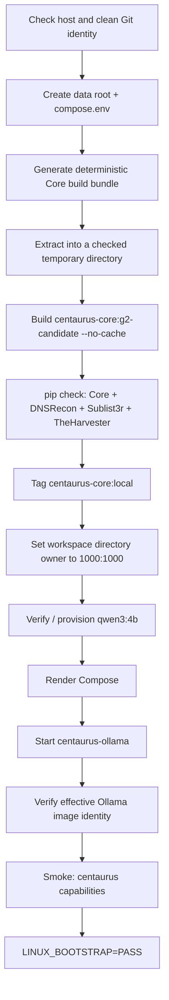

# Git + Docker Deployment on Linux

[Español](DEPLOYMENT_GIT_DOCKER.md) | [English](DEPLOYMENT_GIT_DOCKER.en.md)

[Home](../README.en.md) · [INSTALL.en.md](INSTALL.en.md) · [USER_GUIDE.en.md](USER_GUIDE.en.md)

This guide covers deployment from source on a Linux host. The prebuilt OVA is the main CENTAURUS distribution; see [`INSTALL.en.md`](INSTALL.en.md) to choose a deployment mode.

Use a specific release/tag for a reproducible deployment. Public release: [v1.0.0](https://github.com/M4Rc0s-S3c/centaurus-osint-framework/releases/tag/v1.0.0).

## 1. Requirements

Use a Linux amd64/x86-64 host to reproduce the reference platform, with:

- Git and Python 3 available on the host; host Python generates and verifies artifacts, while production Core runs in its container;
- Docker Engine installed and running;
- the Docker Compose plugin, available as `docker compose`;
- a deployment user able to run `docker info` without adding privilege elevation inside the bootstrap flow;
- Internet access during initial build/provisioning to obtain pinned images, dependencies and the Ollama model;
- storage for Docker images, build cache, the model and the growing investigation workspace.

As a project sizing reference, **8 GiB of RAM and around 30 GiB of storage** provide reasonable headroom for the CPU baseline and investigation data. These are planning figures, not hard limits checked by bootstrap or a guarantee for every workload. Allow extra space for repeated builds, backups and accumulated results; larger inference workloads may require more memory.

Bootstrap stops if a prerequisite check fails. Its initial checks are:

```bash
command -v git
command -v python3
command -v docker
[ "$(uname -s)" = "Linux" ]
docker info
docker compose version
```

**Administrative boundary:** access through the `docker` group grants powerful control over the host. Docker access belongs to host administration; the socket is not mounted inside `centaurus-core`. This deployment model does not replace the restricted analyst entry point of the OVA/USB appliance.

Ollama does not need to be installed on the host: it runs in a container. GPU acceleration is not required. For native Windows scope, see [`DEPLOYMENT_WINDOWS.en.md`](DEPLOYMENT_WINDOWS.en.md).

## 2. Deployment architecture

The checkout contains `docker/Dockerfile`, `docker/compose.yml`, `docker/supply-chain.lock.json`, `requirements-*.lock` and `scripts/bootstrap_linux_release.sh`. The data directory is separate from the build image and retains the model and results.

```mermaid
flowchart TD
    subgraph host["HOST LINUX"]
        repo["Checkout Git CENTAURUS"]
        subgraph data["CENTAURUS_DATA_ROOT"]
            env["compose.env · 0600"]
            rendered["compose.rendered.yml"]
            models["ollama/models · qwen3:4b"]
            workspace["workspace · investigations + logs"]
        end
        subgraph docker["Docker Engine"]
            core["centaurus-core:local"]
            ollama["centaurus-ollama"]
            llm["centaurus-llm-network · internal=true"]
            egress["centaurus-egress-network"]
        end
    end
    repo --> core
    env --> rendered
    rendered --> core
    rendered --> ollama
    models -->|"bind RO: /root/.ollama"| ollama
    workspace -->|"bind RW: /workspace"| core
    core --- llm
    ollama --- llm
    core --- egress
    egress --> sources["OSINT sources"]
```



| Component | Execution and persistence |
| --- | --- |
| Core | On-demand, ephemeral execution through `docker compose run --rm`; `UID:GID 1000:1000`, read-only root filesystem and temporary `/tmp` in tmpfs. |
| Workspace | Host bind mount writable at `/workspace`; contains `investigations/<id>/` and `logs/centaurus.log`. |
| Ollama | Persistent service with a read-only model bind mount; no port published on the host and `OLLAMA_NO_CLOUD=1`. |
| Networks | Core and Ollama share the internal LLM network. Only Core joins the egress network to reach OSINT sources. |

## 3. Obtain the code

```bash
git clone https://github.com/M4Rc0s-S3c/centaurus-osint-framework.git
cd centaurus-osint-framework
```

Refresh references:

```bash
git fetch --tags --prune
```

To deploy the current public release:

```bash
git checkout --detach v1.0.0
```

Verify:

```bash
git rev-parse HEAD
git status --porcelain --untracked-files=all
```

The second command should produce no output.

You may also set the expected commit explicitly:

```bash
export CENTAURUS_RELEASE_COMMIT="$(git rev-parse HEAD)"
```

`CENTAURUS_RELEASE_COMMIT` acts as an identity assertion for initialization.

## 4. What not to do

```text
NO → run bootstrap with local changes
NO → run bootstrap with untracked files
NO → use a moving branch as the only release identity
NO → store Git credentials in the repository
NO → copy .git into the Core image
```

## 5. Persistent directory

When `CENTAURUS_DATA_ROOT` is unset or empty, bootstrap uses:

```text
${XDG_DATA_HOME:-$HOME/.local/share}/centaurus
```

To set it explicitly:

```bash
export CENTAURUS_DATA_ROOT="$HOME/.local/share/centaurus"
```

On a server:

```bash
export CENTAURUS_DATA_ROOT="/srv/centaurus"
```

The directory is used for:

```text
$CENTAURUS_DATA_ROOT/
├── compose.env
├── compose.rendered.yml
├── ollama/
└── workspace/
```

The generated `compose.env` contains only the host paths for Ollama and the workspace (`CENTAURUS_OLLAMA_HOST_DIR` and `CENTAURUS_WORKSPACE_HOST_DIR`) and is created with mode `0600`. Bootstrap regenerates it, so preserve any later custom settings before rerunning.

**Workspace ownership:** initialization runs the image once as root to set the mounted workspace directory owner to `1000:1000`. The current command changes that directory itself, not its contents recursively. `CENTAURUS_DATA_ROOT` must therefore be dedicated to CENTAURUS, rather than a shared folder containing unrelated data. Review existing file permissions when reusing a workspace.

Settings and overrides: [`CONFIGURATION.en.md`](CONFIGURATION.en.md). Persistence layout: [`STORAGE.en.md`](STORAGE.en.md).

## 6. Official initialization

With a clean checkout, a pinned version and the data directory selected:

```bash
./scripts/bootstrap_linux_release.sh
```

Bootstrap executes the following control sequence:



The final marker means bootstrap completed, including its static capability smoke check. It does not establish successful inference or a real investigation on this host. The local Core tag is updated before model and Compose checks; a later failure does not automatically roll it back. Preserve the previous image identity and persistent data before updating.

### 6.1. Deterministic Core build bundle

Bootstrap invokes `python3 scripts/create_core_build_bundle.py` and produces `dist/centaurus-core-build_v1.0.zip`. The package contains the Dockerfile, `pyproject.toml`, runtime locks, supply-chain lock and `src/`. It is extracted into a temporary directory after checking archive paths. Docker builds from that package, rather than the whole checkout; `.git`, tests, documentation and Python build/cache metadata are excluded. Deterministic packaging does not by itself guarantee byte-identical Docker images.

### 6.2. Tool isolation

The Dockerfile installs Core and creates three separate virtual environments:

```text
/opt/centaurus-tools/dnsrecon
/opt/centaurus-tools/sublist3r
/opt/centaurus-tools/theharvester
```

Executables are exposed through links in `/usr/local/bin`. This separation avoids mixing incompatible third-party dependency trees into Core. It isolates dependencies; it is not a separate security sandbox for each tool.

## 7. Supply chain

[`supply-chain.lock.json`](../docker/supply-chain.lock.json) records:

- the Python base image digest, platform and Python/pip versions;
- the Ollama image digest and runtime version;
- DNSRecon, Sublist3r and TheHarvester sources, versions or commits, source hashes, locks and virtual-environment paths;
- build-backend versions (`setuptools` and `flit_core`);
- the identity of `qwen3:4b`: manifest, configuration, model, template, license and parameter digests.

The Dockerfile and dependency locks are build inputs; the supply-chain file records their reference identities and supplies the model verifier. Preserve consistency among these files for the selected release. Recording a hash in this file does not mean every build step automatically checks every recorded hash.

Bootstrap builds with `--no-cache`, then runs `pip check` in four containers with `--network none`: Core and each of the three tool environments. It updates `centaurus-core:local` only after those checks pass. These checks establish installed dependency consistency, not complete source integrity or binary reproducibility.

See [`SECURITY_ARCHITECTURE.en.md`](SECURITY_ARCHITECTURE.en.md) for security controls and their limits.

## 8. Ollama model

Model used:

```text
qwen3:4b
```

The model is stored persistently outside the application container.

Initialization verifies/provisions the model using versioned scripts and supply-chain definitions.

## 9. Startup, use and shutdown

Run these commands on the Linux host, from the checkout used for bootstrap. Use the exact data directory selected in step 5. Prepare the paths in each new terminal; replace the example value if you selected another location:

```bash
export CENTAURUS_DATA_ROOT="$HOME/.local/share/centaurus"
CENTAURUS_ENV_FILE="$CENTAURUS_DATA_ROOT/compose.env"
```

Before continuing, check that `CENTAURUS_ENV_FILE` points to the bootstrap-generated file. Do not use an empty file or omit `--env-file`: Compose defaults may point to a different workspace.

Open an interactive Core session:

```bash
docker compose --env-file "$CENTAURUS_ENV_FILE" -f docker/compose.yml --profile framework run --rm centaurus-core
```

The default command opens `centaurus shell`. Follow [`USER_GUIDE.en.md`](USER_GUIDE.en.md) to use and exit the session. Core is removed on exit; the host workspace persists.

To inspect capabilities and help without starting an investigation or dependencies:

```bash
docker compose --env-file "$CENTAURUS_ENV_FILE" -f docker/compose.yml --profile framework run -T --rm --no-deps centaurus-core centaurus capabilities --rules
docker compose --env-file "$CENTAURUS_ENV_FILE" -f docker/compose.yml --profile framework run -T --rm --no-deps centaurus-core centaurus --help
```

Run one session at a time. To stop the deployment, exit all Core sessions first, then run:

```bash
docker compose --env-file "$CENTAURUS_ENV_FILE" -f docker/compose.yml --profile framework down
```

Host persistent directories are not deleted. To restart the LLM service:

```bash
docker compose --env-file "$CENTAURUS_ENV_FILE" -f docker/compose.yml up -d centaurus-ollama
```

Then open another Core session using the earlier command. If the service has just started, wait for it to become available before using LLM functions.

For operational logs and diagnosis, see [`TROUBLESHOOTING.en.md`](TROUBLESHOOTING.en.md). Supported settings are in [`CONFIGURATION.en.md`](CONFIGURATION.en.md).

## 10. Workspace

Investigations are stored under the persistent workspace.

The logical layout is documented in [`STORAGE.en.md`](STORAGE.en.md).

Do not delete the workspace if traceability or historical results must be preserved.

Before maintenance or version changes, stop investigations and the deployment. Back up the host `workspace/` and `compose.env`; retain `ollama/` too if you need to restore without downloading the model again. Keep the release/commit identity with the backup and preserve permissions and ownership when restoring.

## 11. Optional experimental GPU

The functional baseline uses CPU. Proposed Ollama acceleration on Linux + Docker is documented in [`GPU_OLLAMA_DOCKER.en.md`](GPU_OLLAMA_DOCKER.en.md). This is an experimental variant without CENTAURUS hardware validation; the repository distributes no GPU overlays. The guide covers local examples, prerequisites, checks and return to CPU.

## 12. Basic verification

After installation, check:

```bash
git status --porcelain --untracked-files=all
docker info
docker compose version
```

and run the bootstrap-provided checks/smoke tests.

For development:

```bash
python -m pytest
```

## 13. Updating

To move to another version:

```bash
git fetch --tags --prune
git checkout --detach <TAG_OR_COMMIT>
```

Verify a clean tree and rerun the initialization procedure for that version.

Do not reuse identities or hashes from an older version to declare a newer one valid.

## 14. Related documentation

- [`TROUBLESHOOTING.en.md`](TROUBLESHOOTING.en.md)
- [`CONFIGURATION.en.md`](CONFIGURATION.en.md)
- [`STORAGE.en.md`](STORAGE.en.md)
- [`SECURITY_ARCHITECTURE.en.md`](SECURITY_ARCHITECTURE.en.md)
- [`DEVELOPMENT.en.md`](DEVELOPMENT.en.md)
- [`USER_GUIDE.en.md`](USER_GUIDE.en.md)
