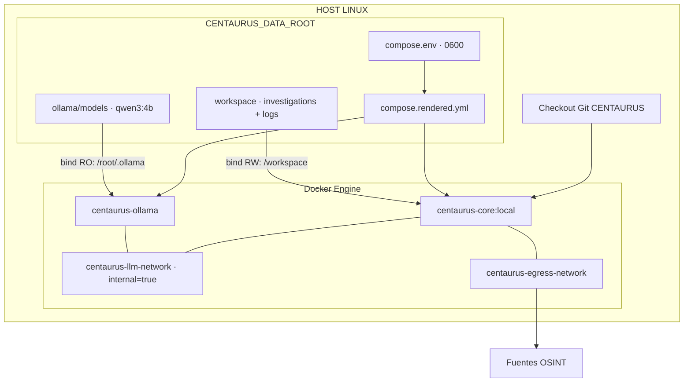
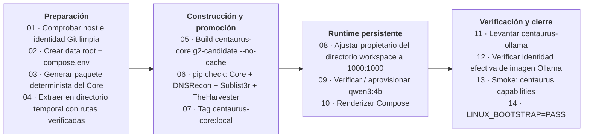

# Despliegue Git + Docker sobre Linux

[Español](DEPLOYMENT_GIT_DOCKER.md) | [English](DEPLOYMENT_GIT_DOCKER.en.md)

[Inicio](../README.md) · [INSTALL.md](INSTALL.md) · [USER_GUIDE.md](USER_GUIDE.md)

Esta guía describe el despliegue desde código fuente sobre un host Linux. La OVA preconstruida es la distribución principal de CENTAURUS; consulta [`INSTALL.md`](INSTALL.md) para elegir modalidad.

Utiliza una release/tag concreta para un despliegue reproducible. Release pública: [v1.0.0](https://github.com/M4Rc0s-S3c/centaurus-osint-framework/releases/tag/v1.0.0).

Estas instrucciones se aplican a `v1.0.0`. El tag conserva documentación local anterior y el paquete Python utiliza una versión distinta; consulta el [alcance de release y documentación](../README.md#release). Mantén disponible la [guía actual en línea](https://github.com/M4Rc0s-S3c/centaurus-osint-framework/blob/main/docs/DEPLOYMENT_GIT_DOCKER.md) al cambiar de tag.

## 1. Requisitos

Utiliza un host Linux amd64/x86-64 para reproducir la plataforma de referencia, con:

- Git y Python 3 disponibles en el host; Python genera y verifica artefactos, mientras que el Core productivo se ejecuta en su contenedor;
- Docker Engine instalado y activo;
- plugin Docker Compose disponible como `docker compose`;
- un usuario de despliegue que pueda ejecutar `docker info` sin añadir elevación de privilegios dentro del flujo de bootstrap;
- acceso a Internet durante la primera construcción/aprovisionamiento para obtener imágenes fijadas, dependencias y el modelo Ollama;
- almacenamiento para imágenes Docker, caché de construcción, modelo y crecimiento del workspace de investigaciones.

Como referencia de dimensionamiento del proyecto, **8 GiB de RAM y del orden de 30 GiB de almacenamiento** proporcionan margen razonable para la baseline CPU y datos de investigación. Son cifras orientativas, no límites comprobados por el bootstrap ni una garantía para cualquier carga. Reserva espacio adicional para construcciones repetidas, copias y resultados acumulados; las cargas de inferencia mayores pueden necesitar más memoria.

La inicialización se detiene si falla una comprobación previa. Sus comprobaciones iniciales son:

```bash
command -v git
command -v python3
command -v docker
[ "$(uname -s)" = "Linux" ]
docker info
docker compose version
```

**Frontera administrativa:** pertenecer al grupo `docker` concede una capacidad elevada sobre el host. El acceso Docker pertenece al plano de administración del host; el socket no se monta dentro de `centaurus-core`. Este modelo de despliegue no sustituye el acceso restringido del analista en la appliance OVA/USB.

No es necesario instalar Ollama en el host: se ejecuta en un contenedor. La GPU no es un requisito. Para el alcance de Windows nativo, consulta [`DEPLOYMENT_WINDOWS.md`](DEPLOYMENT_WINDOWS.md).

## 2. Arquitectura del despliegue

El checkout contiene `docker/Dockerfile`, `docker/compose.yml`, `docker/supply-chain.lock.json`, `requirements-*.lock` y `scripts/bootstrap_linux_release.sh`. El directorio de datos queda separado de la imagen construida y conserva modelo y resultados.



| Componente | Ejecución y persistencia |
| --- | --- |
| Core | Ejecución bajo demanda y efímera mediante `docker compose run --rm`; `UID:GID 1000:1000`, raíz de solo lectura y `/tmp` temporal en tmpfs. |
| Workspace | Montaje del host con escritura en `/workspace`; contiene `investigations/<id>/` y `logs/centaurus.log`. |
| Ollama | Servicio persistente con montaje del modelo en solo lectura; sin puerto publicado en el host y con `OLLAMA_NO_CLOUD=1`. |
| Redes | Core y Ollama comparten la red LLM interna. Solo el Core accede a la red de salida para consultar fuentes OSINT. |

## 3. Obtener el código

```bash
git clone https://github.com/M4Rc0s-S3c/centaurus-osint-framework.git
cd centaurus-osint-framework
```

Actualizar referencias:

```bash
git fetch --tags --prune
```

Para desplegar la release pública actual:

```bash
git checkout --detach v1.0.0
```

Verificar:

```bash
git rev-parse HEAD
git status --porcelain --untracked-files=all
```

El segundo comando debe quedar sin salida.

También puede fijarse explícitamente el commit esperado:

```bash
export CENTAURUS_RELEASE_COMMIT="$(git rev-parse HEAD)"
```

`CENTAURUS_RELEASE_COMMIT` actúa como aserción de identidad para la inicialización.

## 4. Qué no hacer

```text
NO → ejecutar bootstrap con cambios locales
NO → ejecutar bootstrap con untracked files
NO → utilizar una rama móvil como única identidad de release
NO → introducir credenciales Git en el repositorio
NO → copiar .git dentro de la imagen Core
```

## 5. Directorio persistente

Si `CENTAURUS_DATA_ROOT` no está definida o está vacía, el bootstrap utiliza:

```text
${XDG_DATA_HOME:-$HOME/.local/share}/centaurus
```

Para fijarlo explícitamente:

```bash
export CENTAURUS_DATA_ROOT="$HOME/.local/share/centaurus"
```

En un servidor puede utilizarse una ruta dedicada:

```bash
export CENTAURUS_DATA_ROOT="/srv/centaurus"
```

El directorio se utiliza para:

```text
$CENTAURUS_DATA_ROOT/
├── compose.env
├── compose.rendered.yml
├── ollama/
└── workspace/
```

El `compose.env` generado contiene únicamente las rutas host de Ollama y workspace (`CENTAURUS_OLLAMA_HOST_DIR` y `CENTAURUS_WORKSPACE_HOST_DIR`) y se crea con modo `0600`. El bootstrap vuelve a generarlo; conserva los ajustes personalizados añadidos posteriormente antes de repetirlo.

**Propiedad del workspace:** la inicialización ejecuta puntualmente la imagen como root para ajustar el propietario del directorio montado a `1000:1000`. El comando actual cambia ese directorio, no su contenido de forma recursiva. Por ello, `CENTAURUS_DATA_ROOT` debe apuntar a un directorio dedicado a CENTAURUS y no a una carpeta compartida con otros datos. Revisa los permisos de los ficheros existentes cuando reutilices un workspace.

Configuración y ajustes: [`CONFIGURATION.md`](CONFIGURATION.md). Estructura de persistencia: [`STORAGE.md`](STORAGE.md).

## 6. Inicialización oficial

Con el checkout limpio, la versión fijada y el directorio de datos decidido:

```bash
./scripts/bootstrap_linux_release.sh
```

El bootstrap ejecuta estos 14 pasos en orden, agrupados en cuatro fases. Lee cada fase de arriba abajo y avanza de izquierda a derecha:



El marcador final indica que el bootstrap ha terminado, incluida la comprobación de capacidades estáticas. No demuestra una inferencia correcta ni una investigación real en ese host. La etiqueta local del Core se actualiza antes de comprobar modelo y Compose; un fallo posterior no la revierte automáticamente. Conserva la identidad de la imagen anterior y los datos persistentes antes de actualizar.

### 6.1. Paquete determinista de construcción del Core

El bootstrap invoca `python3 scripts/create_core_build_bundle.py` y genera `dist/centaurus-core-build_v1.0.zip`. El paquete contiene Dockerfile, `pyproject.toml`, locks de runtime, lock de suministro y `src/`. Se extrae en un directorio temporal tras verificar las rutas del archivo. Docker construye desde ese paquete, en lugar del checkout completo; quedan fuera `.git`, tests, documentación y metadatos de construcción/caché Python. El empaquetado determinista no garantiza por sí solo imágenes Docker idénticas byte a byte.

### 6.2. Aislamiento de herramientas

El Dockerfile instala el Core y crea tres entornos virtuales separados:

```text
/opt/centaurus-tools/dnsrecon
/opt/centaurus-tools/sublist3r
/opt/centaurus-tools/theharvester
```

Los ejecutables se exponen mediante enlaces en `/usr/local/bin`. Esta separación evita mezclar árboles de dependencias incompatibles de terceros con el entorno del Core. Es aislamiento de dependencias; no constituye un sandbox de seguridad independiente por herramienta.

## 7. Cadena de suministro

[`supply-chain.lock.json`](../docker/supply-chain.lock.json) registra:

- digest de la imagen base Python, plataforma y versiones de Python/pip;
- digest de la imagen Ollama y versión de su runtime;
- fuentes, versiones o commits, hashes de fuentes, locks y rutas de entornos virtuales de DNSRecon, Sublist3r y TheHarvester;
- versiones de los backends de construcción (`setuptools` y `flit_core`);
- identidad de `qwen3:4b`: digests del manifiesto, configuración, modelo, plantilla, licencia y parámetros.

Dockerfile y locks de dependencias son entradas de construcción; el fichero de suministro registra sus identidades de referencia y alimenta al verificador del modelo. Mantén la coherencia entre esos ficheros para la release elegida. Que un hash figure en este fichero no significa que cada paso de construcción compruebe automáticamente todos los hashes registrados.

El bootstrap construye con `--no-cache` y después ejecuta `pip check` en cuatro contenedores con `--network none`: Core y cada uno de los tres entornos de herramientas. Solo tras superar esas comprobaciones actualiza `centaurus-core:local`. Se comprueba la coherencia de dependencias instaladas, no la integridad completa de fuentes ni la reproducibilidad binaria.

Consulta [`SECURITY_ARCHITECTURE.md`](SECURITY_ARCHITECTURE.md) para los controles de seguridad y sus límites.

## 8. Modelo Ollama

Modelo utilizado:

```text
qwen3:4b
```

El modelo se almacena de forma persistente fuera del contenedor de aplicación.

La inicialización verifica/aprovisiona el modelo según los scripts y la cadena de suministro versionados.

## 9. Arranque, uso y parada

Los siguientes comandos se ejecutan desde el checkout utilizado para el bootstrap, en el host Linux. Usa exactamente el directorio de datos elegido en el paso 5. En cada nueva terminal, prepara las rutas; si elegiste otra ubicación, sustituye el valor del ejemplo:

```bash
export CENTAURUS_DATA_ROOT="$HOME/.local/share/centaurus"
CENTAURUS_ENV_FILE="$CENTAURUS_DATA_ROOT/compose.env"
```

Antes de continuar, comprueba que `CENTAURUS_ENV_FILE` apunta al fichero generado por el bootstrap. No uses un fichero vacío ni omitas `--env-file`: las rutas por defecto de Compose pueden apuntar a otro workspace.

Abre la sesión interactiva del Core:

```bash
docker compose --env-file "$CENTAURUS_ENV_FILE" -f docker/compose.yml --profile framework run --rm centaurus-core
```

El comando por defecto abre `centaurus shell`. Sigue [`USER_GUIDE.md`](USER_GUIDE.md) para usar la sesión y salir. El Core se elimina al terminar; el workspace del host se conserva.

Para consultar capacidades y ayuda sin iniciar una investigación ni arrancar dependencias:

```bash
docker compose --env-file "$CENTAURUS_ENV_FILE" -f docker/compose.yml --profile framework run -T --rm --no-deps centaurus-core centaurus capabilities --rules
docker compose --env-file "$CENTAURUS_ENV_FILE" -f docker/compose.yml --profile framework run -T --rm --no-deps centaurus-core centaurus --help
```

Ejecuta una sesión cada vez. Para detener el despliegue, sal antes de todas las sesiones del Core y después ejecuta:

```bash
docker compose --env-file "$CENTAURUS_ENV_FILE" -f docker/compose.yml --profile framework down
```

Los directorios persistentes del host no se borran. Para volver a iniciar el servicio LLM:

```bash
docker compose --env-file "$CENTAURUS_ENV_FILE" -f docker/compose.yml up -d centaurus-ollama
```

Después puede abrirse otra sesión del Core con el comando anterior. Si el servicio acaba de arrancar, espera a que esté disponible antes de utilizar funciones LLM.

Para consultar logs y diagnosticar incidencias, sigue [`TROUBLESHOOTING.md`](TROUBLESHOOTING.md). Los ajustes admitidos están en [`CONFIGURATION.md`](CONFIGURATION.md).

## 10. Workspace

Las investigaciones se conservan bajo el workspace persistente.

El layout lógico se documenta en [`STORAGE.md`](STORAGE.md).

No borres el workspace si necesitas preservar trazabilidad o resultados históricos.

Antes de mantenimiento o cambios de versión, detén las investigaciones y el despliegue. Respalda `workspace/` y `compose.env` del host; conserva también `ollama/` si necesitas restaurar sin descargar de nuevo el modelo. Guarda la identidad de release/commit junto a la copia y conserva permisos y propietarios al restaurar.

## 11. GPU opcional y experimental

La baseline funcional utiliza CPU. La propuesta de aceleración de Ollama sobre Linux + Docker está documentada en [`GPU_OLLAMA_DOCKER.md`](GPU_OLLAMA_DOCKER.md). Es una variante experimental sin validación de hardware por CENTAURUS; el repositorio no distribuye overlays GPU. La guía describe ejemplos locales, requisitos, comprobaciones y reversión a CPU.

## 12. Verificación básica

Después de la instalación, comprobar:

```bash
git status --porcelain --untracked-files=all
docker info
docker compose version
```

y ejecutar las comprobaciones/smoke tests proporcionados por el bootstrap.

Para desarrollo, prepara primero las dependencias de pruebas y el intérprete descritos en [`DEVELOPMENT.md`](DEVELOPMENT.md) y ejecuta después su procedimiento de validación.

## 13. Actualización

Antes de cambiar de versión, detén las investigaciones y respalda los datos persistentes según el apartado 10.

Para cambiar de versión:

```bash
git fetch --tags --prune
git checkout --detach <TAG_O_COMMIT>
```

Verifica que el árbol esté limpio y contrasta `git rev-parse HEAD` con el commit completo esperado de la nueva release según su publicación. Si `CENTAURUS_RELEASE_COMMIT` sigue definido en esta terminal, puede conservar el commit anterior. Solo después de confirmar la nueva identidad, sustituye esa aserción:

```bash
export CENTAURUS_RELEASE_COMMIT="<COMMIT_COMPLETO_VERIFICADO>"
```

Sustituye el marcador; no lo pegues literalmente. Repite el procedimiento de inicialización de esa versión con el directorio de datos previsto. No elimines la aserción simplemente para eludir una discrepancia.

No reutilices identidades o hashes de una versión anterior para declarar válida una versión posterior.

## 14. Documentación relacionada

- [`TROUBLESHOOTING.md`](TROUBLESHOOTING.md)
- [`CONFIGURATION.md`](CONFIGURATION.md)
- [`STORAGE.md`](STORAGE.md)
- [`SECURITY_ARCHITECTURE.md`](SECURITY_ARCHITECTURE.md)
- [`DEVELOPMENT.md`](DEVELOPMENT.md)
- [`USER_GUIDE.md`](USER_GUIDE.md)
